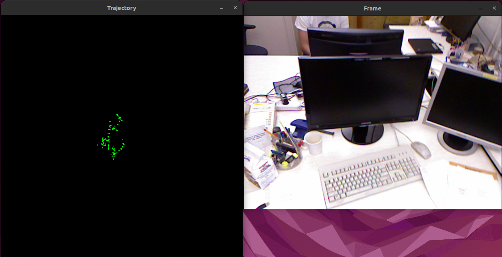

# Part 1: Initial Visual Odometry
A basic visual odometry program consists on estimating important features on two consecutive frames, matching these features and, then, extract the essential matrix from the matches. From the essential matrix, and taking into account the calibration matrix, we are able to recover the pose (translation and rotation) between these two frames. By concatenating the poses of every two consecutive frames, we can compute the trajectory of the camera.

However, with monocular visual odometry, the scale of the translation of the pose is up to scale, so we can not concatenate two arbitrary poses due to the scale ambiguity problem. There are different approaches like using known objects in the scene to derive the scale, use SfM with bundle adjustment between frames or, the simplest version that we are goint to use initially, assume constant velocity and, thus, normalize the translation between every pair of frames to assume its norm is one.

## Step 1: Download the 'freiburg1_xyz' dataset
We are goint to use a basic dataset, the [freiburg1_xyz](https://cvg.cit.tum.de/data/datasets/rgbd-dataset/download#freiburg1_xyz) dataset, which consists of a typical desk in an office environment with translation movements along the principal axes (x,y,z) with the orientation mostly fixed.

1. Create a folder to store the dataset:
```bash
mkdir data
```
2. Download the dataset:
```bash
curl curl -o data/freiburg1_xyz.tgz https://cvg.cit.tum.de/rgbd/dataset/freiburg1/rgbd_dataset_freiburg1_xyz.tgz
```
3. Extract the dataset:
```bash
tar -xvzf data/freiburg1_xyz.tgz -C data/
```

The dataset contains depth and rgb images (in `depth/` and `rgb/` folders), and data about the accelerometer and a groundtruth trajectory defining the translation and rotation.

## Step 2: Read the dataset and show it
````c++
#include <filesystem>
#include <opencv2/opencv.hpp>

int main() {
  // 1. Read path of frames
  const std::string path{"../data/rgbd_dataset_freiburg1_xyz/rgb"};
  std::vector<std::filesystem::path> frames_in_directory;
  std::copy(std::filesystem::directory_iterator(path),
            std::filesystem::directory_iterator(),
            std::back_inserter(frames_in_directory));
  std::sort(frames_in_directory.begin(), frames_in_directory.end());

  // 2. Display the images
  for (const auto& frame_path : frames_in_directory) {
    auto current_frame = cv::imread(frame_path.string());
    cv::imshow("Display Frame", current_frame);
    cv::waitKey(0);
  }

  cv::destroyAllWindows();
  return 0;
}
````

## Step 3: Simple Visual Odometry
Visual Odometry, at its simplest, is composed of three main components: feature detection and computation, feature matching and motion estimation. These three components allow to estimate the motion between any two pair of frames that have some overlapping part of the image. Then, by concatenating the motion of consecutive frames, we can compute the trajectory that the camera has followed.

So, first, let's declare some variables that we will use:
```c++
  auto prev_frame = cv::Mat{};
  std::vector<cv::KeyPoint> prev_keypoints;
  auto prev_descriptors = cv::Mat{};
  auto current_frame = cv::Mat{};
  std::vector<cv::KeyPoint> current_keypoints;
  auto current_descriptors = cv::Mat{};
  std::vector<cv::DMatch> matches;
  cv::Mat pose = cv::Mat::eye(4, 4, CV_64F);
  cv::Mat trajectory =
      cv::Mat::zeros(600, 600, CV_8UC3);  // For trajectory visualization
```
and the calibration matrix of the camera, extracted from the freiburg1_xyz data:
```c++
  const cv::Mat K =
      (cv::Mat_<double>(3, 3) << 517.3, 0, 318.6, 0, 516.5, 255.3, 0, 0, 1);
```

Now, we can start with the main components of the Visual Odometry pipeline. First, detect and compute ORB features:
```c++
  for (const auto& frame_path : frames_in_directory) {
    current_frame = cv::imread(frame_path.string());

    if (prev_frame.empty()) {
      prev_frame = current_frame;
      orb->detectAndCompute(prev_frame, cv::noArray(), prev_keypoints,
                            prev_descriptors);
      continue;
    }

    // Feature detection in current frame
    orb->detectAndCompute(current_frame, cv::noArray(), current_keypoints,
                          current_descriptors);
    ...
  }
```
Then, we match the features and extract the keypoints of the features matched:
```c++
  for (const auto& frame_path : frames_in_directory) {
    ...
    // Match features using brute force
    bf.match(prev_descriptors, current_descriptors, matches);
    // Sort matches by distance
    std::sort(matches.begin(), matches.end(),
              [](const cv::DMatch& m1, const cv::DMatch& m2) {
                return m1.distance < m2.distance;
              });
    // Extract matched keypoints
    std::vector<cv::Point2f> prev_pts;
    std::vector<cv::Point2f> current_pts;
    for (const auto& match : matches) {
      prev_pts.push_back(prev_keypoints[match.queryIdx].pt);
      current_pts.push_back(current_keypoints[match.trainIdx].pt);
    }
    ...
  }
```
We estimate the essential matrix and recover the pose using the points corresponding to the features matched:
```c++
  for (const auto& frame_path : frames_in_directory) {
    ...
    // Estimate essential matrix
    cv::Mat E = cv::findEssentialMat(prev_pts, current_pts, K, cv::RANSAC,
                                     0.999, 1.0, cv::noArray());

    // Recover pose
    cv::Mat R;
    cv::Mat t;
    cv::recoverPose(E, prev_pts, current_pts, R, t);
    ...
  }
```
As explained before, the scale of the recovered pose is ambiguous when using monocular vision, so we make the constant velocity assumption and normalize the norm of the translation vector `t`:
```c++
  for (const auto& frame_path : frames_in_directory) {
    ...
    // Normalize translation vector to maintain consistent scale
    double curr_t_magnitude = cv::norm(t);
    if (curr_t_magnitude > 0) {
      double scale = 10.0 / curr_t_magnitude;
      t *= scale;
    }
    ...
  }
```
Now, we have a normalize translation and rotation vector from the previous frame to the current frame. We want to compute the current pose transformation (in homogeneous coordinates and) concatenate them to create the trajectory:
```c++
  for (const auto& frame_path : frames_in_directory) {
    ...
    // Update the pose
    cv::Mat curr_pose = cv::Mat::eye(4, 4, CV_64F);
    R.copyTo(curr_pose(cv::Rect(0, 0, 3, 3)));
    t.copyTo(curr_pose(cv::Rect(3, 0, 1, 3)));
    pose *= curr_pose;
    ...
  }
```
After computing the pose, we can draw the trajectory and display it:
```c++
  for (const auto& frame_path : frames_in_directory) {
    ...
    // Draw trajectory
    double x = pose.at<double>(0, 3);
    double z = pose.at<double>(2, 3);
    cv::circle(trajectory,
               cv::Point(300 + static_cast<int>(x), 300 - static_cast<int>(z)),
               1, cv::Scalar(0, 255, 0), 1);
    // Display results
    cv::imshow("Trajectory", trajectory);
    cv::imshow("Frame", current_frame);
    ...
  }
```
Finally, we have to update any reference to values of the previous frames with the values of the current frame:
```c++
  for (const auto& frame_path : frames_in_directory) {
    ...
    // Update previous frame
    prev_frame = current_frame;
    prev_keypoints = current_keypoints;
    prev_descriptors = current_descriptors;
    
    if (cv::waitKey(1) == 'q') {
      break;
    }
  }
```
With this, we are able to observe the trajectory in a simple way as frames are processed:


## Next Steps:
This basic implementation of Visual Odometry can be extended to improve its robustness, speed, quality of code, visualization, etc. Also, we need a way to evaluate the error in our computation and compare it with the ground truth.