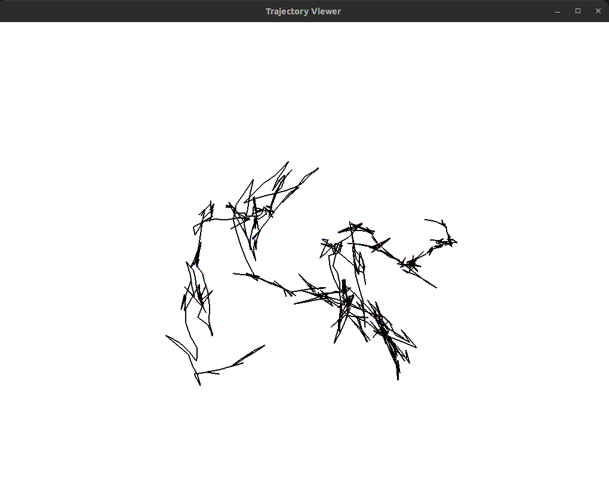

# Part 3: Visualization
One of the best ways to debug and assess the quality of the trajectory estimation is to visualize it. We are going to use [Pangolin](https://github.com/stevenlovegrove/Pangolin) to visualize the trajectory that we compute.

# Part 0: Installation and Building
In order to build Pangolin, we are goint to install it as a submodule in our repository in `ext/` folder, for external dependencies:
```bash
git submodule add https://github.com/stevenlovegrove/Pangolin.git ./ext/Pangolin
```
This will download the Pangolin library in our repository. To include it in our building process, we need to add it as a subdirectory in our `CMakeLists.txt` with the following lines:
```cmake
# Pangolin
add_subdirectory(ext/Pangolin)
find_package(Pangolin REQUIRED)
include_directories(${Pangolin_INCLUDE_DIRS})
```
and link it as a library when we build our program:
```cmake
add_executable(proto_reconstruction src/main.cpp)
target_link_libraries(proto_reconstruction ${OpenCV_LIBS} ${Pangolin_LIBRARIES})
```
It is possible that you need to install the Python Development libraries, with the following command (for the 3.10 version, you might need another one):
```bash
sudo apt install python3.10-dev
```

# Part 1: Draw trajectory with pangolin
We are going to create a function to draw the trajectory (inspired from [SLAM Book](https://github.com/gaoxiang12/slambook2)). This is going to be the first function in a different file, so we create the file `src/visualization/visualizer.cpp` with this function:
```c++
#include "proto_recon/visualization/visualizer.h"

#include <pangolin/pangolin.h>
#include <unistd.h>

#include <opencv2/opencv.hpp>
#include <vector>

void drawTrajectory(const std::vector<cv::Mat>& trajectory) {
  // create pangolin window and plot the trajectory
  pangolin::CreateWindowAndBind("Trajectory Viewer", 1024, 768);
  glEnable(GL_DEPTH_TEST);
  glEnable(GL_BLEND);
  glBlendFunc(GL_SRC_ALPHA, GL_ONE_MINUS_SRC_ALPHA);

  // Define Projection and initial ModelView matrix
  pangolin::OpenGlRenderState s_cam(
      pangolin::ProjectionMatrix(1024, 768, 500, 500, 512, 389, 0.1, 1000),
      pangolin::ModelViewLookAt(0, -0.1, -1.8, 0, 0, 0, 0.0, -1.0, 0.0));

  // Create Interactive View in window
  pangolin::View& d_cam = pangolin::CreateDisplay()
                              .SetBounds(0.0, 1.0, 0.0, 1.0, -1024.0F / 768.0F)
                              .SetHandler(new pangolin::Handler3D(s_cam));

  while (pangolin::ShouldQuit() == false) {
    glClear(GL_COLOR_BUFFER_BIT | GL_DEPTH_BUFFER_BIT);
    d_cam.Activate(s_cam);
    glClearColor(1.0F, 1.0F, 1.0F, 1.0F);
    glLineWidth(2);
    for (size_t i = 0; i < trajectory.size(); i++) {
      // draw three axes of each pose
      // Vector3d Ow = poses[i].translation();
      // Vector3d Xw = poses[i] ∗ (0.1 ∗ Vector3d(1, 0, 0));
      // Vector3d Yw = poses[i] ∗ (0.1 ∗ Vector3d(0, 1, 0));
      // Vector3d Zw = poses[i] ∗ (0.1 ∗ Vector3d(0, 0, 1));
      glBegin(GL_LINES);
      glColor3f(1.0, 0.0, 0.0);
      glVertex3d(trajectory[i].at<double>(0, 3), trajectory[i].at<double>(1, 3),
                 trajectory[i].at<double>(2, 3));
      glVertex3d(trajectory[i].at<double>(0, 3) + 0.1,
                 trajectory[i].at<double>(1, 3),
                 trajectory[i].at<double>(2, 3));
      glColor3f(0.0, 1.0, 0.0);
      glVertex3d(trajectory[i].at<double>(0, 3), trajectory[i].at<double>(1, 3),
                 trajectory[i].at<double>(2, 3));
      glVertex3d(trajectory[i].at<double>(0, 3),
                 trajectory[i].at<double>(1, 3) + 0.1,
                 trajectory[i].at<double>(2, 3));
      glColor3f(0.0, 0.0, 1.0);
      glVertex3d(trajectory[i].at<double>(0, 3), trajectory[i].at<double>(1, 3),
                 trajectory[i].at<double>(2, 3));
      glVertex3d(trajectory[i].at<double>(0, 3), trajectory[i].at<double>(1, 3),
                 trajectory[i].at<double>(2, 3) + 0.1);
      glEnd();
    }

    // draw a connection
    for (size_t i = 0; i < trajectory.size() - 1; i++) {
      glColor3f(0.0, 0.0, 0.0);
      glBegin(GL_LINES);
      auto p1 = trajectory[i], p2 = trajectory[i + 1];
      glVertex3d(p1.at<double>(0, 3), p1.at<double>(1, 3), p1.at<double>(2, 3));
      glVertex3d(p2.at<double>(0, 3), p2.at<double>(1, 3), p2.at<double>(2, 3));
      glEnd();
    }
    pangolin::FinishFrame();
    usleep(5000);
    // sleep 5 ms
  }
}
```
and the corresponding header file in `include/proto_recon/visualization/visualizer.h`:
````c++
#pragma once

#include <opencv2/opencv.hpp>
#include <vector>

void drawTrajectory(const std::vector<cv::Mat>& trajectory);
````
Now, we can call this function at the end of our visual odometry process in the `main()` function:
```c++
int main() {
  ...
  writeTrajectory(frames_in_directory, trajectory);
  drawTrajectory(trajectory);
  return 0;
}
```
and it will produce a window with the trajectory in 3D. This is an example 
We can see how the trajectory is quite abrupt, since the estimation is not very good as we saw in the previous chapter [2_Evaluation](2_Evaluation.md).