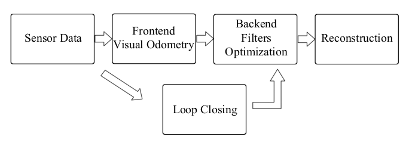

# Part 4: Visual Odometry Overview

In a classical visual SLAM framework, there are the following modules (obtained
from [SLAM Book](https://github.com/gaoxiang12/slambook2)):


The Frontend (or Visual Odometry) is described briefly in [Part2: Evaluation](2_Evaluation.md) and it consists on
estimating the camera movement between adjacent frames.
The Backend (filtering and optimization) receives camera poses at different stamps from the frontend and applies
optimization to refine the camera poses. The loop closing component determines whether the camera has already visited
the current location, recomputing the current pose to reduce the drift. The reconstruction component tries to compute a
task-specific map based on the estimated trajectory.

## Step 0: Installing Eigen and Sophus

Since an important part consists on estimating camera movement between frames, we will
use [Eigen](https://eigen.tuxfamily.org/index.php?title=Main_Page) and [Sophus](https://github.com/strasdat/Sophus) to
represent translations and rotations. We need to install Eigen it in the system:

```bash
sudo apt install libeigen3-dev
```

and add Sophus as an external dependency:

```bash
git submodule add https://github.com/strasdat/Sophus.git ./ext/Sophus
```

Now, we can add them as libraries to our program in the `CMakeLists.txt` file:

```cmake
...
# EXTERNAL PACKAGES
# Eigen
find_package(Eigen3 3.3 REQUIRED NO_MODULE)
...
# Sophus
include_directories(ext/Sophus)
...
target_link_libraries(proto_reconstruction Eigen3::Eigen ${OpenCV_LIBS} ${Pangolin_LIBRARIES})
...
```

## Step 1: Classes for Visual Odometry

The Visual Odometry process needs to process each frame, obtain key features of the image (and the location of these
features in the frame, also known as keypoints). Then, it will match keypoints from different frames and triangulate
them to compute the 3D location of these keypoints, and will take the name of mappoint. For this reason, we are going to
need the classes:

- `Frame` to store information about keypoints in 2D, its descriptors, the pose of this frame and link to map points
  triangulated from the keypoints
- `MapPoint` to store information about the 3D position of the mappoint, its descriptor associated to the keypoint used
  to triangulate the mappoint.
- `Map` to store information about all the keyframes and mappoints, including the pose of each one.

Class `include/proto_recon/vo/mappoint.h`:

```c++
#pragma once

#include <opencv2/core.hpp>
#include <Eigen/Core>

namespace proto_recon {

class MapPoint {
 public:
  explicit MapPoint(const Eigen::Vector3f& position3D);
  uint64_t id() const;

 private:
  uint64_t id_;
  Eigen::Vector3f position3D_;
  cv::Mat desc_;  // Most distinct descriptor of the MapPoint

  static uint64_t next_id_;
};

}  // namespace proto_recon
```

and the implementation in `src/vo/mappoint.cpp`:

```c++
#include "proto_recon/vo/mappoint.h"

#include <utility>

namespace proto_recon {

uint64_t MapPoint::next_id_ = 0;

MapPoint::MapPoint(Eigen::Vector3f position3D)
    : position3D_(std::move(position3D)) {
  id_ = next_id_;
  next_id_++;
}

uint64_t MapPoint::id() const { return id_; }

}  // namespace proto_recon
```

It contains info about a unique identifier (`id_`), the 3d position (`position3D_`) and a field to store the most
distinct descriptor (`desc_`).

Now, the class `include/proto_recon/vo/frame.h`:

```c++
#pragma once

#include <opencv2/core.hpp>
#include <sophus/se3.hpp>
#include <vector>

#include "proto_recon/vo/mappoint.h"

namespace proto_recon {

class Frame {
 public:
  Frame();
  Frame(uint64_t id, double timestamp, cv::Mat img);
  uint64_t id() const;
  const std::vector<cv::KeyPoint>& keypoints() const;
  const cv::Mat& descriptors() const;
  const Sophus::SE3f& Tcw() const;
  void setTcw(const Sophus::SE3f& Tcw);
  void setMapPoint(int idx, const std::shared_ptr<MapPoint>& map_point);
  void extractFeatures();

 private:
  uint64_t id_;
  double timestamp_;
  cv::Mat img_;
  std::vector<cv::KeyPoint> kp_;
  cv::Mat desc_;
  std::vector<std::shared_ptr<MapPoint>> map_points_;
  Sophus::SE3f Tcw_;  // Pose of the frame
};

}  // namespace proto_recon
```
and the implementation in `src/vo/frame.cpp`:
```c++
#include "proto_recon/vo/frame.h"

#include <opencv2/features2d.hpp>
#include <utility>

namespace proto_recon {

Frame::Frame() : id_(-1), timestamp_(-1) {}

Frame::Frame(const uint64_t id, const double timestamp, cv::Mat img)
    : id_(id), timestamp_(timestamp), img_(std::move(img)) {}

void Frame::extractFeatures() {
  // TODO: improve this so that it does not instantiate every time
  const auto orb = cv::ORB::create(1000);
  orb->detectAndCompute(img_, cv::noArray(), kp_, desc_);
  // Reserve memory for each keypoint that can potentially become a map point
  map_points_.resize(kp_.size());
}

uint64_t Frame::id() const { return id_; }

const std::vector<cv::KeyPoint>& Frame::keypoints() const { return kp_; }

const cv::Mat& Frame::descriptors() const { return desc_; }

const Sophus::SE3f& Frame::Tcw() const { return Tcw_; }

void Frame::setTcw(const Sophus::SE3f& Tcw) { Tcw_ = Tcw; }

void Frame::setMapPoint(const int idx,
                        const std::shared_ptr<MapPoint>& map_point) {
  map_points_[idx] = map_point;
}

}  // namespace proto_recon
```
It contains info about a unique identifier (`id_`), the timestamp of the frame (`timestamp_`), the corresponding image of the frame (`img_`), the keypoints and its descriptors (`kp_` and `desc_`), a list of pointers to the map points computed from the keypoints (`map_points_`) and the pose of the frame (`Tcw_`).

We also modify `main.cpp` to make use of these new classes:
```c++
#include <filesystem>
#include <fstream>
#include <opencv2/core/quaternion.hpp>
#include <opencv2/opencv.hpp>

#include "proto_recon/visualization/visualizer.h"
#include "proto_recon/vo/frame.h"

int main() {
  // 1. Read path of images
  const std::string path{"../data/rgbd_dataset_freiburg1_xyz/rgb"};
  std::vector<std::filesystem::path> imgs_in_directory;
  std::copy(std::filesystem::directory_iterator(path),
            std::filesystem::directory_iterator(),
            std::back_inserter(imgs_in_directory));
  std::sort(imgs_in_directory.begin(), imgs_in_directory.end());

  // 2. Set classes:
  // Brute Force Matcher
  auto bf = cv::BFMatcher(cv::NORM_HAMMING, true);

  // 3. Initialize variables
  auto prev_frame = proto_recon::Frame{};
  auto current_frame = proto_recon::Frame{};
  std::vector<cv::DMatch> matches;
  cv::Mat pose = cv::Mat::eye(4, 4, CV_64F);
  std::vector<cv::Mat> trajectory;
  cv::Mat trajectory_img =
      cv::Mat::zeros(600, 600, CV_8UC3);  // For trajectory visualization

  // 4. Set calibration matrix
  const cv::Mat K =
      (cv::Mat_<double>(3, 3) << 517.3, 0, 318.6, 0, 516.5, 255.3, 0, 0, 1);

  // 5. Iterate over the frames
  uint64_t frame_id = 0;
  for (const auto& img_path : imgs_in_directory) {
    const auto img = cv::imread(img_path.string());
    current_frame = proto_recon::Frame(frame_id, frame_id, img);

    if (prev_frame.id() == -1) {
      prev_frame = current_frame;
      prev_frame.extractFeatures();
      continue;
    }

    // Feature detection in current frame
    current_frame.extractFeatures();

    // Match features using brute force
    bf.match(prev_frame.descriptors(), current_frame.descriptors(), matches);
    // Sort matches by distance
    std::sort(matches.begin(), matches.end(),
              [](const cv::DMatch& m1, const cv::DMatch& m2) {
                return m1.distance < m2.distance;
              });
    // Extract matched keypoints
    std::vector<cv::Point2f> prev_pts;
    std::vector<cv::Point2f> current_pts;
    for (const auto& match : matches) {
      prev_pts.push_back(prev_frame.keypoints()[match.queryIdx].pt);
      current_pts.push_back(current_frame.keypoints()[match.trainIdx].pt);
    }

    // Estimate essential matrix
    cv::Mat E = cv::findEssentialMat(prev_pts, current_pts, K, cv::RANSAC,
                                     0.999, 1.0, cv::noArray());

    // Recover pose
    cv::Mat R;
    cv::Mat t;
    cv::recoverPose(E, prev_pts, current_pts, R, t);

    // Normalize translation vector to maintain consistent scale
    double curr_t_magnitude = cv::norm(t);
    if (curr_t_magnitude > 0) {
      double scale = 10.0 / curr_t_magnitude;
      t *= scale;
    }

    // Update the pose
    cv::Mat curr_pose = cv::Mat::eye(4, 4, CV_64F);
    R.copyTo(curr_pose(cv::Rect(0, 0, 3, 3)));
    t.copyTo(curr_pose(cv::Rect(3, 0, 1, 3)));
    pose *= curr_pose;

    // Draw trajectory
    double x = pose.at<double>(0, 3);
    double z = pose.at<double>(2, 3);
    cv::circle(trajectory_img,
               cv::Point(300 + static_cast<int>(x), 300 - static_cast<int>(z)),
               1, cv::Scalar(0, 255, 0), 1);

    // Display results
    cv::imshow("Trajectory", trajectory_img);
    cv::imshow("Frame", current_frame.img());
    trajectory.push_back(pose.clone());

    // Update previous frame
    prev_frame = current_frame;
    ++frame_id;

    if (cv::waitKey(1) == 'q') {
      break;
    }
  }

  cv::destroyAllWindows();
  writeTrajectory(imgs_in_directory, trajectory);
  proto_recon::drawTrajectory(trajectory);
  return 0;
}
```